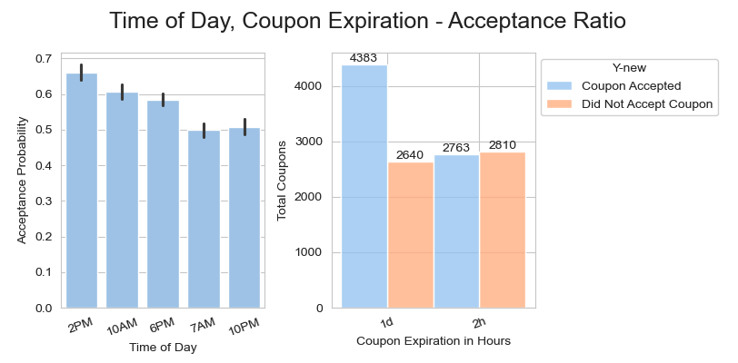

## Will a customer accept a coupon?

### Background

The objective of this exercise is to review coupons dataset and  distinguish various features that differentiate customers who accepted a driving coupon versus those that did not. 

### Data Analysis jupyter notebook
The data analysis notebook can be found at this public github repository:
https://github.com/mgk2014/PCMLAI-coupon

### Data description
The data set comes from UCI Machine Learning Repository. Detailed description of this data is available at https://archive.ics.uci.edu/dataset/603/in+vehicle+coupon+recommendation

### Data preparation tasks
After analysis, the following tasks were taken to address missing values, redundant categorical values, & duplicates
1. Removed car column since car column is missing > 95% of its values
2. For columns < 1% missing values, filled values of the most common value observed in that column
3. Removed categorical values that appear to denote the same meaning
4. Dropped duplicates
5. Added extra columns that translate coupon acceptance and direction in intuitive text

## Summary of findings

- Total 12684 coupons were offered, 7146 (56.73%) coupons were accepted 
- Coffee house coupons were offered the most 3987, while expensive restaurants coupons were the least offered 1486
- Most coupons were offered (6484) when temperature was 80
- For drivers that were offered **bar coupons**
    - 2008 bar coupons were distributed out of which 822 (40.94%) were accepted
    - Drivers who went to bar three or fewer times were 4.37 times more likely to accept a bar coupon (669 accepted) v/s those that went more times (153 accepted)
    - Drivers who went to bar more than once a month and were > 25 yrs old accepted coupons 64.5% of the times (530 coupons accepted)
    - Drivers who go to bars more than once a month, do not have kid passengers, and are in non-farming jobs, accepted coupons 71% of the times (393 out of 551 coupons accepted)
 - For drivers that were offered coupons to **cheap restaurants (<20$)**
    - 2775 cheap restaurant coupons were distributed out of which 1963 (70.74%) were accepted
    - Female drivers (with kid passengers) were offered 161 coupons out of which they accepted, 120 coupons at an 75% acceptance rate. Males drivers, when kids were present, on other hand were offered 106 coupons, they accepted 73 (68% acceptance rate)
    - Drivers with passengers age 21, 26, 31 received more coupons than the middle age (36,41,46) drivers. 50plus drivers break this trend and receive more coupons than the middle age drivers
    - Coupons where driving time to the restaurant is 25 min received 307 coupons, and accepted only 101 (32% acceptance rate)
    
 #### Hypothesis

A couple of hypothesis may be drawn from this preliminary analysis. These require further investigations for confirmation.

- Drivers who go to bars atleast once a month, are older than 25, and do not have kids, on average are more likely accept a bar coupon, than the others
- Cheap restaurant coupons have a higher likelyhood of acceptance than bar coupons. The acceptance of cheap restaurant coupons increase if female passengers with kids are driving, and the driving time is lower

 ## Next Steps and Recommendations

The analysis presented here is very brief and explores only a couple of coupon types. The following next steps are recommended for further analysis and confirmation of findings:

- Explore acceptance rates of other coupon type - such as coffee houses, carry out, and expensive restaurants
- Explore relationships between additional variables such as destination, weather, time of day, expiration, income, has children and acceptance rates of coupons
- Determine the variables that have the strongest co-relation to the target variable i.e. will the driver accept the coupon
- Build a model to predict future acceptance of coupons, given this data set and independent variables

## Detailed findings and visual explanations

This analysis includes exploration of overall data set, bar coupons and cheap restaurant coupons.

1. Total 12684 coupons were offered, 7146 (56.73%) coupons were accepted 

    

2. Coffee house coupons were offered the most 3987, while expensive restaurants coupons were the least offered 1486
    

3. Most coupons were offered (6484) when temperature was 80

4. There is a higher chance of coupons being accepted at 2pm and 10am. 2H coupons have a higher chance of acceptance than coupons that expire in a day.
    

5. More coupons were offered and accepted when drivers were in opposite direction
    

### Bar Coupons

 1. 2008 bar coupons were distributed out of which 822 (40.94%) were accepted

    

 2. Drivers who went to bar three or fewer times were **4.32** times more likely to accept a bar coupon (669 accepted) v/s those that went more times (153 accepted)
 
    

 3. Drivers who went to bar more than once a month and were > 25 yrs old accepted coupons 64.5% of the times (530 coupons accepted)

    

 4. Drivers who go to bars more than once a month, did not have kid passangers and are in non-farming jobs, accepted coupons 71% of the times (393 out of 551 coupons accepted)
 
    

5. Acceptance rates of cheap restaurant coupons to drivers < 50k income is much higher than acceptance rates of bar coupons to drivers who go to bars once a month, had no kids in the car and were not widowed, OR bar coupons to drivers who go to bars once a month, and are less than 30 yrs of age

    

### Cheap Restaurant Coupons

1. It appears that female drivers with kids receive and accept more coupons than male drivers with kids*

    

2. It appears that drivers with passengers age 21, 26, 31 receive farm more coupons than the middle age (36,41,46) drivers. 50plus drivers break this trend and receive more coupons than the middle age drivers

    

3. Coupons where driving time to the restaurant is 25 min received 307 coupons, and accepted only 101 (32% acceptance rate)

    

